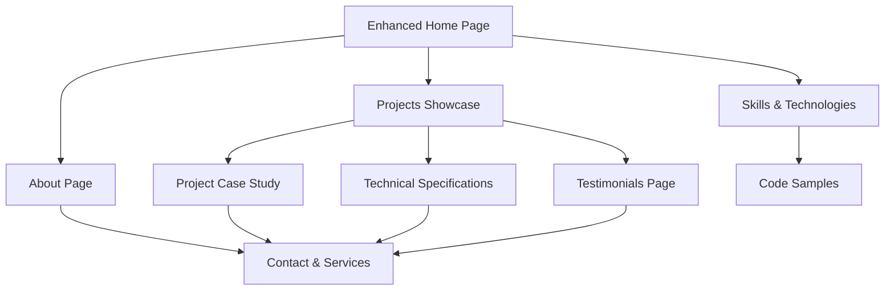

# Mobile Development Portfolio Enhancement - Product Requirements Document

## 1. Product Overview

Enhance the existing mobile development portfolio website to create a comprehensive, professional showcase that effectively demonstrates expertise in mobile app development and attracts potential clients and employers.

The enhanced portfolio will transform the current basic project showcase into a world-class mobile development portfolio featuring advanced project presentations, professional testimonials, technical specifications, and optimized user experience across all devices.

## 2. Core Features

### 2.1 User Roles

| Role | Registration Method | Core Permissions |
|------|---------------------|------------------|
| Visitor | No registration required | Can browse portfolio, view projects, contact developer |
| Potential Client | Contact form submission | Can request quotes, download resume, view detailed case studies |
| Recruiter | LinkedIn/email contact | Can access technical specifications, view testimonials, schedule consultations |

### 2.2 Feature Module

Our enhanced mobile portfolio consists of the following main pages:

1. **Enhanced Home Page**: Hero section with animated elements, skills showcase, featured projects carousel, testimonials preview, and clear call-to-action buttons.
2. **Comprehensive About Page**: Professional bio, detailed skills matrix, experience timeline, certifications, and downloadable resume.
3. **Advanced Projects Showcase**: Detailed project case studies, technical specifications, app store links, GitHub repositories, and interactive demos.
4. **Skills & Technologies Page**: Comprehensive technology stack, proficiency levels, code samples, and learning journey.
5. **Testimonials & Reviews Page**: Client testimonials, app store reviews, LinkedIn recommendations, and success metrics.
6. **Contact & Services Page**: Professional contact form, service offerings, pricing tiers, and consultation booking.

### 2.3 Page Details

| Page Name | Module Name | Feature Description |
|-----------|-------------|---------------------|
| Enhanced Home Page | Hero Section | Animated introduction with professional headshot, dynamic typing effect for roles, and prominent CTA buttons |
| Enhanced Home Page | Skills Preview | Interactive technology icons with hover effects showing proficiency levels |
| Enhanced Home Page | Featured Projects | Carousel showcasing top 3 mobile projects with app store badges and quick stats |
| Enhanced Home Page | Testimonials Preview | Rotating client testimonials with star ratings and company logos |
| Comprehensive About Page | Professional Bio | Detailed background story, career journey, and professional philosophy |
| Comprehensive About Page | Skills Matrix | Visual representation of technical skills with proficiency bars and experience years |
| Comprehensive About Page | Experience Timeline | Interactive timeline showing career progression and key achievements |
| Comprehensive About Page | Certifications | Display of relevant certifications, courses, and professional development |
| Advanced Projects Showcase | Project Case Studies | Detailed project breakdowns with problem, solution, and results sections |
| Advanced Projects Showcase | Technical Specifications | Architecture diagrams, technology stack, development timeline, and team size |
| Advanced Projects Showcase | App Store Integration | Live app store ratings, download counts, and user reviews |
| Advanced Projects Showcase | Interactive Demos | Embedded app previews, video walkthroughs, and screenshot galleries |
| Skills & Technologies Page | Technology Stack | Comprehensive list of mobile development technologies with experience levels |
| Skills & Technologies Page | Code Samples | GitHub integration showing code quality and development practices |
| Skills & Technologies Page | Learning Journey | Timeline of skill acquisition and continuous learning initiatives |
| Testimonials & Reviews Page | Client Testimonials | Detailed client feedback with project context and results achieved |
| Testimonials & Reviews Page | App Store Reviews | Aggregated user reviews from published applications |
| Testimonials & Reviews Page | Success Metrics | Quantified achievements like app downloads, user ratings, and business impact |
| Contact & Services Page | Professional Contact Form | Multi-step form with project requirements, budget, and timeline fields |
| Contact & Services Page | Service Offerings | Clear description of mobile development services and specializations |
| Contact & Services Page | Consultation Booking | Calendar integration for scheduling discovery calls and consultations |

## 3. Core Process

**Visitor Journey Flow:**
Visitors land on the enhanced home page, are immediately impressed by the professional presentation and animated elements. They explore featured projects through the carousel, read testimonial previews, and navigate to detailed project case studies. After reviewing technical specifications and success metrics, they proceed to the contact page to inquire about services or schedule a consultation.

**Recruiter Flow:**
Recruiters access the portfolio through LinkedIn or job boards, quickly scan the skills matrix and experience timeline on the about page, review detailed project case studies for technical depth, check testimonials for validation, and either download the resume or initiate contact through the professional form.

**Client Flow:**
Potential clients discover the portfolio through referrals or search, explore the services page to understand offerings, review case studies relevant to their industry, read client testimonials for credibility, and submit a detailed project inquiry through the multi-step contact form.

## 4. User Interface Design

### 4.1 Design Style

- **Primary Colors**: Deep blue (#1a365d) for trust and professionalism, bright accent color (#3182ce) for CTAs
- **Secondary Colors**: Light gray (#f7fafc) for backgrounds, dark gray (#2d3748) for text
- **Button Style**: Modern rounded buttons with subtle shadows and hover animations
- **Typography**: Inter font family for headings (600 weight), Open Sans for body text (400 weight)
- **Layout Style**: Card-based design with generous white space, mobile-first responsive grid
- **Icons**: Feather icons for consistency, technology-specific logos for skills section
- **Animations**: Subtle fade-in effects, smooth transitions, and micro-interactions

### 4.2 Page Design Overview

| Page Name | Module Name | UI Elements |
|-----------|-------------|-------------|
| Enhanced Home Page | Hero Section | Full-screen gradient background, centered content with animated typing effect, professional headshot with subtle animation, dual CTA buttons with distinct styling |
| Enhanced Home Page | Skills Preview | Grid layout with technology icons, hover effects revealing proficiency levels, smooth transitions between states |
| Enhanced Home Page | Featured Projects | Horizontal carousel with project cards, app store badges, swipe gestures for mobile, navigation dots |
| Comprehensive About Page | Skills Matrix | Horizontal bar charts with animated fill effects, color-coded by proficiency level, responsive grid layout |
| Advanced Projects Showcase | Project Cards | Large hero images, overlay text with project details, hover effects revealing additional information, consistent card spacing |
| Advanced Projects Showcase | Case Study Layout | Two-column layout with images on left, detailed text on right, responsive stacking on mobile |
| Contact & Services Page | Contact Form | Multi-step wizard interface, progress indicator, field validation with inline feedback, professional styling |

### 4.3 Responsiveness

The portfolio is designed mobile-first with progressive enhancement for larger screens. Touch interactions are optimized for mobile devices, including swipe gestures for project carousels and touch-friendly button sizing. The layout adapts seamlessly from mobile (320px) to desktop (1920px+) with appropriate breakpoints at 768px, 1024px, and 1440px.

**Mobile Optimizations:**
- Simplified navigation with hamburger menu
- Stacked layouts for better readability
- Larger touch targets (minimum 44px)
- Optimized images with lazy loading
- Reduced animation complexity for performance

**Desktop Enhancements:**
- Multi-column layouts for efficient space usage
- Hover effects and micro-interactions
- Larger hero sections with more visual impact
- Side-by-side content presentation
- Enhanced typography hierarchy