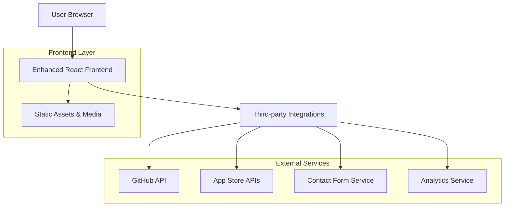
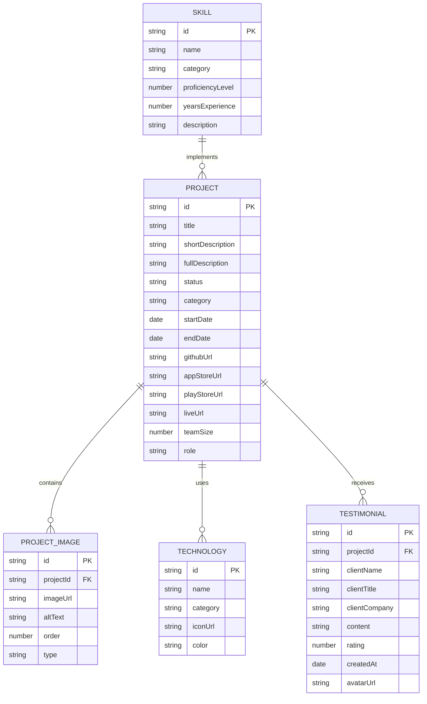

# Mobile Development Portfolio Enhancement - Technical Architecture Document

## 1. Architecture Design



## 2. Technology Description

- **Frontend**: React@18 + TypeScript + Tailwind CSS@3 + Framer Motion + Vite
- **Build Tool**: Vite for fast development and optimized production builds
- **Styling**: Tailwind CSS with custom design system and responsive utilities
- **Animations**: Framer Motion for smooth transitions and micro-interactions
- **Icons**: Lucide React for consistent iconography
- **Forms**: React Hook Form with Zod validation
- **Deployment**: Vercel for seamless CI/CD and global CDN

## 3. Route Definitions

| Route | Purpose |
|-------|---------|
| / | Enhanced home page with hero section, skills preview, and featured projects |
| /about | Comprehensive about page with professional bio, skills matrix, and experience timeline |
| /projects | Advanced projects showcase with detailed case studies and technical specifications |
| /projects/:slug | Individual project case study with in-depth analysis and technical details |
| /skills | Skills and technologies page with comprehensive technology stack and code samples |
| /testimonials | Testimonials and reviews page with client feedback and success metrics |
| /contact | Contact and services page with professional form and consultation booking |
| /resume | Downloadable resume page with PDF generation capability |

## 4. API Definitions

### 4.1 Core APIs

**GitHub Integration**
```
GET https://api.github.com/users/JonathanJude/repos
```

Response:
| Param Name | Param Type | Description |
|------------|------------|-------------|
| name | string | Repository name |
| description | string | Project description |
| language | string | Primary programming language |
| stargazers_count | number | GitHub stars count |
| html_url | string | Repository URL |

**Contact Form Submission**
```
POST /api/contact
```

Request:
| Param Name | Param Type | isRequired | Description |
|------------|------------|------------|-------------|
| name | string | true | Client's full name |
| email | string | true | Client's email address |
| company | string | false | Client's company name |
| projectType | string | true | Type of mobile project |
| budget | string | true | Project budget range |
| timeline | string | true | Expected project timeline |
| description | string | true | Detailed project description |

Response:
| Param Name | Param Type | Description |
|------------|------------|-------------|
| success | boolean | Submission status |
| message | string | Response message |
| id | string | Submission reference ID |

Example:
```json
{
  "name": "John Smith",
  "email": "john@company.com",
  "company": "Tech Startup Inc",
  "projectType": "iOS App",
  "budget": "$10,000 - $25,000",
  "timeline": "3-4 months",
  "description": "We need a mobile app for our e-commerce platform..."
}
```

**App Store Data Integration**
```
GET /api/app-store-data/:appId
```

Response:
| Param Name | Param Type | Description |
|------------|------------|-------------|
| rating | number | Average app rating |
| reviewCount | number | Total number of reviews |
| downloadCount | string | Estimated download count |
| currentVersion | string | Latest app version |

## 5. Data Model

### 5.1 Data Model Definition



### 5.2 Data Definition Language

**Projects Data Structure (projects.json)**
```json
{
  "id": "kippa-mobile-app",
  "title": "Kippa - SME Bookkeeping App",
  "shortDescription": "Simple bookkeeping app for small and medium enterprises",
  "fullDescription": "Comprehensive mobile application that enables SMEs to manage their finances, track transactions, send invoices, and monitor customer debts through SMS and WhatsApp integration.",
  "category": "fintech",
  "status": "live",
  "startDate": "2022-01-15",
  "endDate": "2022-08-30",
  "teamSize": 4,
  "role": "Lead Mobile Developer",
  "technologies": ["Flutter", "Dart", "Firebase", "REST API", "SQLite"],
  "features": [
    "Transaction recording and categorization",
    "Invoice and receipt generation",
    "Customer debt tracking",
    "SMS and WhatsApp integration",
    "Offline data synchronization",
    "Multi-currency support"
  ],
  "challenges": [
    "Implementing offline-first architecture",
    "Integrating multiple payment gateways",
    "Ensuring data security and compliance"
  ],
  "results": {
    "downloads": "50,000+",
    "rating": 4.5,
    "userRetention": "78%",
    "businessImpact": "Helped 10,000+ SMEs digitize their bookkeeping"
  },
  "images": [
    {
      "url": "assets/img/kippa/hero.png",
      "alt": "Kippa app dashboard",
      "type": "hero"
    },
    {
      "url": "assets/img/kippa/features.png",
      "alt": "Key features overview",
      "type": "feature"
    }
  ],
  "links": {
    "appStore": "https://apps.apple.com/app/kippa/id1234567890",
    "playStore": "https://play.google.com/store/apps/details?id=com.africave.kippa",
    "github": "https://github.com/example/kippa",
    "website": "https://kippa.africa"
  },
  "testimonials": [
    {
      "clientName": "Sarah Johnson",
      "clientTitle": "Small Business Owner",
      "content": "Kippa transformed how I manage my business finances. The app is intuitive and has saved me hours of manual bookkeeping.",
      "rating": 5,
      "avatar": "assets/img/testimonials/sarah.jpg"
    }
  ]
}
```

**Skills Data Structure (skills.json)**
```json
{
  "categories": [
    {
      "name": "Mobile Development",
      "skills": [
        {
          "name": "Flutter",
          "proficiencyLevel": 95,
          "yearsExperience": 4,
          "description": "Expert in building cross-platform mobile applications",
          "projects": ["Kippa", "eNaira", "Staarm"],
          "certifications": ["Google Flutter Certified Developer"]
        },
        {
          "name": "React Native",
          "proficiencyLevel": 85,
          "yearsExperience": 3,
          "description": "Proficient in React Native development and native module integration",
          "projects": ["HaggleX", "Accelerate"]
        }
      ]
    },
    {
      "name": "Backend Development",
      "skills": [
        {
          "name": "Laravel",
          "proficiencyLevel": 90,
          "yearsExperience": 5,
          "description": "Advanced Laravel development with API design expertise"
        }
      ]
    }
  ]
}
```

**Contact Form Schema (TypeScript)**
```typescript
interface ContactFormData {
  personalInfo: {
    name: string;
    email: string;
    phone?: string;
    company?: string;
    website?: string;
  };
  projectDetails: {
    type: 'ios' | 'android' | 'cross-platform' | 'web-app';
    category: 'ecommerce' | 'fintech' | 'healthcare' | 'education' | 'other';
    description: string;
    features: string[];
    timeline: '1-2 months' | '3-4 months' | '5-6 months' | '6+ months';
    budget: '<$5k' | '$5k-$15k' | '$15k-$30k' | '$30k-$50k' | '$50k+';
  };
  additionalInfo: {
    hasDesigns: boolean;
    hasBackend: boolean;
    needsConsultation: boolean;
    preferredContact: 'email' | 'phone' | 'video-call';
    message?: string;
  };
}
```

## 6. Performance Optimization

### 6.1 Frontend Optimizations
- **Code Splitting**: Route-based code splitting with React.lazy()
- **Image Optimization**: WebP format with fallbacks, lazy loading, and responsive images
- **Bundle Analysis**: Webpack Bundle Analyzer for identifying optimization opportunities
- **Caching Strategy**: Service worker implementation for offline functionality
- **CDN Integration**: Vercel Edge Network for global content delivery

### 6.2 Mobile Performance
- **Critical CSS**: Inline critical CSS for above-the-fold content
- **Resource Hints**: Preload, prefetch, and preconnect for faster loading
- **Touch Optimization**: 300ms click delay elimination and touch gesture support
- **Viewport Optimization**: Proper viewport meta tags and responsive design
- **Progressive Enhancement**: Core functionality works without JavaScript

### 6.3 SEO Optimization
- **Meta Tags**: Dynamic meta tags for each page with Open Graph support
- **Structured Data**: JSON-LD schema markup for rich snippets
- **Sitemap**: Automated sitemap generation for search engine indexing
- **Analytics**: Google Analytics 4 and Google Search Console integration
- **Core Web Vitals**: Optimization for LCP, FID, and CLS metrics